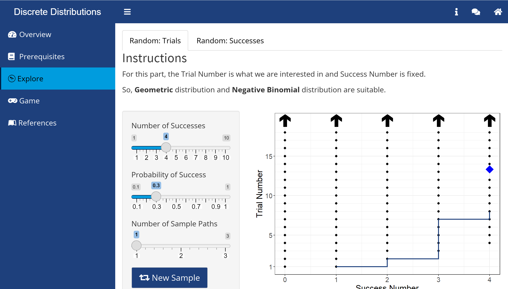

# Discrete_Distributions

# App Description
This app would focus on Bernoulli, Binomial, Hypergeometric, Geometric and Negative Binomial distributions. This app would explore different sample spaces and sample paths. Also, it would help users to choose suitable distribution in actual life scenario and show the Probability Mass Function graphs about that distribution.
